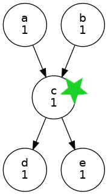

# Workflow-driven DR fail-over with Cylc 8.4

## The Problem

I need to (re)start my cycling workflows mid-run on a remote Disaster Recovery
(DR) platform. I want to rewind the graph as little as possible, to return to
timely production quickly.

## The Solution

With Cylc 8 we can start a flow anywhere in the graph. There's no need to
"warm start" from the beginning of a previous cycle, and no need to sync the
workflow database for restart from a workflow checkpoint. We just have to
ensure that the data on disk is compatible with the workflow start point.
So, we can:
- choose any number of convenient sync points in the graph
  - the more sync points, the less re-running of tasks after fail-over
  - (start with a few, automate their handling, then add more as desired)
- at sync points, transfer the critical data, needed to restart at that point,
  to the DR site
  - the data must be positioned to look as if it was generated by the
    workflow at the DR site
  - (positioning could be done during transfer, or just before start-up
    for the latest sync point)
- then update a DB to say that this sync point is ready for start-up if needed
  - disk state (data) and workflow state are guaranteed to be compatible at
  start-up (very unlikely to be true if relying on workflow-independent low-level
  disk-sync)

This could be done by adding sync tasks into the main workflows, or with a separate
"sync workflow" that triggers sync tasks off of the main workflow sync point tasks.
The sync workflow could be auto-generated from a sync point configuraiton file. 

For each sync point, record what needs to be done to start the worklow there. This
may include:
- triggering one or more tasks via `cylc play --start-task=ID` (below)
- handling off-flow prerequisites, if any (below)
- handling parentless tasks, if any (below)

## Details

### Sync Points

Choose sync points with an understanding of the graph. They should be at
bottlenecks, where possible, to simplify data transfer and start-up logic.

<table>
<tr>
<td align="left">
  <!-- spacer for full width table! -->
Task c is a good sync point.<br/>
<code>a & b => c => d & e</code>
</td>
<td align="center">
  <!-- spacer for full width table! -->

</td>
</tr>
</table>

A sync point could be defined:
- where task `c` starts running,
  - copy its input data over for the potential restart at `c`
- or where task `c` succeeds,
  - copy its output for `d` and `e` over for a potential restart downstream of `c`
- (or both)

Which is preferred may depend on how expensive `c` is to run. If `c` already finished
at the main site, the later sync point would avoid rerunning it on failover.

Sync points can be spread (not bottlenecks) if necessary:
<table>
<tr>
<td align="left">
  <!-- spacer for full width table! -->
Trigger the flow at (b, y)<br/>
<code>a => b => c
x => y => z 
</code>
</td>
<td align="center">
  <!-- spacer for full width table! -->

</td>
</tr>
</table>

Even independent sync points on different graph paths can work, with
appropriate start-up logic:

<table>
<tr>
<td align="left">
  <!-- spacer for full width table! -->
Trigger the flow at the most recent sync point on each path:
(a or c) and (x or y).<br/>
<code>a => b => c
x => y => z
</code>
</td>
<td align="center">
  <!-- spacer for full width table! -->

</td>
</tr>
</table>

### Handling Off-flow Prerequisites

Off-flow prerequisites represent dependence on tasks that are not strictly
downstream of the trigger points (this may include dependence on tasks in
a previous cycle). Off-flow prerequisites must be artificially satisfied
to avoid stalling the workflow.

<table>
<tr>
<td align="left">
  <!-- spacer for full width table! -->
<p>
If I trigger a flow at <code>a</code> the workflow will stall waiting
on off-flow prerequisite <code>y => b</code>.<br/>

To prevent the stall:<br/>
- use `cylc set` to artificially satisfy the prerequisite</br>
- (Cylc 8.5) trigger <code>a, b,</code> and <code>c</code> at once
(group trigger artificially satisfies off-group prerequisites).
</p>
</td>
<td align="center">
  <!-- spacer for full width table! -->

</td>
</tr>
</table>

#### Mitigation by "start tasks"

To start a flow from scratch, such as on DR
fail-over, use (e.g.) `cylc play --start-task=ID1 --start-task=ID2 ...` and
any dependence on previous-cycle points will be ignored.

(However this only applies to the cycle point of the earliest start task.
If you have multiple cycling intervals you may still need to use `cylc set`
to satisfy some off-flow prerequisites).

### Handling Parentless Tasks

Cycling workflows typically have parentless tasks at the top of each cycle
(parentless means no dependence on other tasks upstream; they may still be
clock-triggered or xtriggered). There are no upstream outputs to spawn
parentless tasks in the flow, so in a normal run from the initial cycle point
the scheduler does it automatically within the runahead limit.

If you trigger a new flow from other points in the graph, you will have to
specifically trigger (or `cylc set --pre=all`) a particular cycle point
instance of any parentless tasks, after which the scheduler take over. 

<table>
<tr>
<td align="left">
  <!-- spacer for full width table! -->
<p>
If I trigger a flow at <code>2/a</code> the workflow will stall waiting
on off-flow prerequisite <code>3/x => 3/a</code>.<br/>

To prevent the stall:
- artificially satisfy the off-flow prerequisite with `cylc set`
- use `cylc set --pre=all //3/x` to spawn the first instance of `x`

Alternatively:
- trigger the flow at <code>2/x</code> instead of <code>2/a</code>
- use `cylc set` on the now off-flow prerequisite <code>1/a => 2/a</code>

</p>
</td>
<td align="center">
  <!-- spacer for full width table! -->

</td>
</tr>
</table>

### Handling Dependence on Initial Prep Tasks

If your workflow graph begins with tasks that prep the workspace and (e.g.)
build or deploy code for the other tasks, you may need to run these again
before starting the flow at the sync point.

To do this:
 1. start the workflow paused, so that start tasks don't run yet
 2. hold the waiting start tasks, then resume (unpause) the workflow
 3. manually trigger the initial prep task(s):
    - if just one prep task, trigger it with `--flow=none` to avoid flow-on
    - else hold tasks downstream of the prep pipeline to avoid flow-on,
       and remove the held tasks once the flow reaches them
 4. once the prep task(s) finish, release (unhold) the start tasks

## An example


This example shows how to start a workflow at an arbitrary sync point,
illustrating the issues discussed above (we assume sync point data has
been copied in first).

that the right data has 
**TODO: expand to several examples, both simpler and more difficult.**

Sync point (see `cgraph.png` with cycle point 2 -> 3):
- I can start from `3/a`, `3/x`, and `4/data`
- I need the start-up task 1/prep to run first
- No stall due to off-flow or inter-cycle dependencies

NOTE: note `cylc play --start-task` uses pre-initial ignore on intercycle dependencies.

1. start paused, with the start tasks in the pool waiting
```console
$ cylc vip --pause ecx -t //3/a -t //3/x -t //4/data
```

2. resume the workflow after holding the start tasks
```console
$ cylc hold 'ecx//*'
$ cylc play ecx
```

3. run the start-up task without flow-on
```console
$ cylc trigger --flow=none ecx//1/prep
```

4. release the waiting start tasks, to start the flow

```console
$ cylc release "ecx//*"
```
